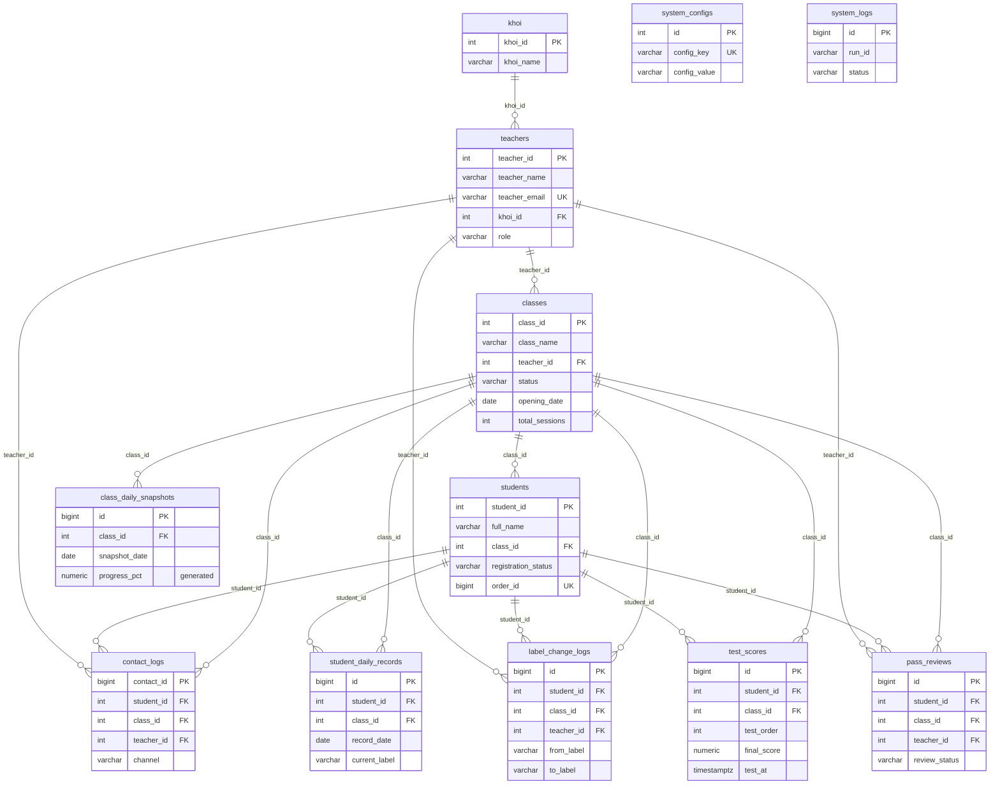

# Database Architecture — IZONE Label Dashboard

> Sinh ra bằng cách kết nối trực tiếp vào Postgres production (`izone_postgres_prod` trên VPS `izone_vps` / `160.187.146.127`) và introspect schema thật (`\d+`, `information_schema`), **không** đọc từ Prisma schema hay migration file — nên đây là hiện trạng DB thật tại thời điểm viết, có thể lệch với `backend/prisma/schema.prisma` nếu ai đó sửa DB tay mà quên đồng bộ Prisma.
>
> Cập nhật: 2026-08-12, sau khi áp `database/migrations/006_historical_test_snapshots.sql` lên prod (thêm `test_scores.test_at`, index `idx_test_scores_student_test_at`, 2 hàm PL/pgSQL `izone.label_from_average`/`izone.refresh_student_daily_snapshot`). Backup trước khi migrate: `pg_dump -F c` lưu ở `/root/izone_dashboard_pre_006.dump` trên VPS host. Nếu schema đổi tiếp (thêm bảng/cột/FK), chạy lại phần "Cách tự cập nhật file này" ở cuối file.
>
> **Lưu ý riêng, cùng ngày:** `database/migrations/007_stage_based_test_snapshots.sql` cũng xuất hiện trong working tree (chưa commit git, `git status` báo `??`) nhưng **chưa được áp dụng lên Postgres prod** — không thấy `snapshot_stage`/`test_7`/`test_8` khi introspect `student_daily_records` ở §3 dưới, và không có code backend/frontend nào (kể cả module `dashboards` mới, xem `ARCHITECTURE.md` §3) tham chiếu tới các cột này hay hàm `izone.refresh_student_stage_snapshot` mà nó định nghĩa. Coi đây là nháp chưa dùng, không phải hiện trạng DB thật.

File này **chỉ nói về cấu trúc DB** (bảng, quan hệ, ràng buộc, mục đích từng bảng). Quy tắc nghiệp vụ (ngưỡng gán nhãn, pass chuẩn/pass mềm...) đã có sẵn và đầy đủ hơn ở [`ARCHITECTURE.md` §2](../../ARCHITECTURE.md#2-quy-tắc-nghiệp-vụ-không-đổi-chỉ-đổi-nguồn--vẫn-đã-verify-trên-dữ-liệu-cũ) — không lặp lại ở đây, chỉ trỏ tới khi liên quan.

## 0. Kết nối

| | |
|---|---|
| Host | VPS `izone_vps` (`160.187.146.127`), SSH alias đã lưu trong `~/.ssh/config` |
| Container | `izone_postgres_prod` (image `postgres:16-alpine`) |
| Database | `izone_dashboard` |
| Schema | `izone` (không dùng `public`) |
| User | `postgres` |
| Port | `5432` (expose ra ngoài host, không chỉ nội bộ Docker network) |
| Password | Xem `DB_PASSWORD` trong `/root/izone-label-dashboard/docker-compose.prod.yml` trên VPS — không chép lại ở đây |
| Query nhanh | `ssh izone_vps "docker exec izone_postgres_prod psql -U postgres -d izone_dashboard -c '\dt izone.*'"` |

Container anh em cùng compose file: `izone_backend_prod` (NestJS, port 3000), `izone_dashboard_prod` (React build qua nginx, port 8088). Cùng VPS còn có các workload không liên quan (`n8n`, `proctoring_backend`, `rabbitmq`, `minio_server`) — đừng nhầm log/container của chúng với hệ thống này.

## 1. Tổng quan schema

12 bảng, 17 foreign key, 4 view, 2 hàm PL/pgSQL nghiệp vụ (từ 2026-08-12, xem §4). Chia làm 4 nhóm theo vai trò:

| Nhóm | Bảng | Đặc điểm |
|---|---|---|
| **Master / danh mục** | `khoi`, `teachers`, `classes`, `students`, `system_configs` | Ít thay đổi, UPDATE tại chỗ, có `updated_at` + trigger tự cập nhật |
| **Time-series theo ngày** | `class_daily_snapshots`, `student_daily_records` | 1 dòng/entity/ngày, **INSERT-only** (không UPDATE dòng cũ), unique constraint trên `(entity_id, date)` |
| **Sự kiện / append-only log** | `test_scores`, `label_change_logs`, `contact_logs`, `pass_reviews` | Mỗi dòng là 1 sự kiện rời rạc (1 lượt thi, 1 lần đổi nhãn, 1 lần liên hệ, 1 lần xét duyệt) |
| **Vận hành hệ thống** | `system_logs` | Log pipeline/workflow, không liên quan nghiệp vụ HV |

Điểm kiến trúc quan trọng nhất: **tách định danh tĩnh khỏi lịch sử theo ngày**. `classes`/`students` chỉ giữ thông tin hiện tại; toàn bộ lịch sử điểm danh/BTVN/điểm test/nhãn nằm ở `class_daily_snapshots`/`student_daily_records`, mỗi ngày một dòng mới — cho phép truy vết xu hướng mà không cần bảng audit riêng. 4 view (`v_class_latest`, `v_student_latest`, `v_weekly_trend`, `v_monthly_trend`) dùng `DISTINCT ON (...) ORDER BY date DESC` để dựng "trạng thái mới nhất" từ chuỗi snapshot — đây là cách các API `GET /classes`, `GET /students/by-class/:id` lấy dữ liệu, không query thẳng bảng snapshot.

## 2. Sơ đồ quan hệ (ER diagram)



`system_configs` và `system_logs` không có FK — đứng độc lập, không xuất hiện trong diagram trên ngoài phần liệt kê cột.

Toàn bộ 17 FK dùng `ON UPDATE NO ACTION ON DELETE NO ACTION` — **không có CASCADE nào**. Nghĩa là xoá một `students`/`classes`/`teachers` đang có dữ liệu con (snapshot, test_scores, logs...) sẽ bị Postgres chặn bằng lỗi FK violation, không tự động xoá lan. Muốn xoá thật phải dọn bảng con trước, theo thứ tự ngược lại sơ đồ trên.

## 3. Chi tiết từng bảng

### Nhóm Master / danh mục

#### `khoi` (10 dòng)
Danh mục "khối" (nhóm giáo viên/chương trình theo cấp độ) của trung tâm — đơn giản nhất trong schema, chỉ `khoi_id`, `khoi_name`, `created_at`. Là gốc của chuỗi FK: `khoi → teachers → classes → students`.

#### `teachers` (237 dòng)
Master giáo viên. `teacher_email` unique (dùng làm định danh đăng nhập theo `CLAUDE.md`). `khoi_id` FK tới `khoi` (default `34` nếu không set). `role` giới hạn `teacher`/`lead`/`admin` (CHECK constraint) — phân quyền dashboard Lead-Khối vs Teacher dựa vào cột này. Có trigger `trg_teachers_updated` tự set `updated_at` khi UPDATE.

#### `classes` (1282 dòng)
Master lớp học. `teacher_id` FK bắt buộc (1 lớp luôn có 1 GV chủ nhiệm ở thời điểm hiện tại — lịch sử đổi GV không được lưu). `status` giới hạn `pending`/`upcoming`/`on_going`/`completed`/`cancelled` (CHECK). `total_sessions` default `28` — **cảnh báo**: cột `progress_pct` (generated) ở `class_daily_snapshots` hard-code chia cho `total_sessions` của snapshot đó chứ không đọc lại cột này của `classes`, xem ARCHITECTURE.md §4 nếu cần chi tiết bug tiềm ẩn này. Là bảng cha của 7 bảng khác (nhiều FK trỏ vào nhất trong schema).

#### `students` (19,773 dòng — bảng lớn thứ 2 sau `test_scores` về row count, lớn nhất về entity)
Master học viên. `registration_status` có 9 giá trị hợp lệ (CHECK): `on_going`, `transferred`, `pending`, `on_hold`, `cancelled`, `completed`, `dropped`, `not_completed`, `queuing`. `order_id` unique — liên kết tới hệ thống đơn hàng/ghi danh bên ngoài (không có bảng `orders` trong schema này, `order_id` là tham chiếu ngoài). `class_id` FK bắt buộc — 1 HV thuộc đúng 1 lớp tại một thời điểm (chuyển lớp = update `class_id`, không giữ lịch sử lớp cũ ở bảng này, chỉ có thể suy ra qua `student_daily_records`/`label_change_logs` nếu chúng ghi `class_id` tại thời điểm đó).

#### `system_configs` (23 dòng)
Key-value config toàn hệ thống — ngưỡng gán nhãn (`nguong_xam_max`, `nguong_do_min/max`, `nguong_vang_min`), ngưỡng pass chuẩn/pass mềm (`pass_dh_min`, `soft_g1_test_min`...). **Nguồn duy nhất** của mọi ngưỡng nghiệp vụ — không hard-code ở code, xem ARCHITECTURE.md §2 để biết ý nghĩa từng key. Không có FK, không liên kết bảng nào khác.

### Nhóm Time-series theo ngày

#### `class_daily_snapshots` (100 dòng — mới, ít lịch sử tích luỹ)
1 dòng = trạng thái tổng hợp của 1 lớp tại 1 ngày cụ thể. Unique `(class_id, snapshot_date)`. Chứa số liệu tổng hợp: số HV active/on-hold/dropped/transferred, điểm danh/BTVN trung bình, tỷ lệ pass chuẩn/pass mềm, phân bố nhãn (`label_yellow`/`label_red`/`label_grey`/`label_no_data`), `risk_pct`, cờ `is_alarm_triggered`, `health_status`. Cột `progress_pct` là **generated column** (`completed_sessions * 100 / total_sessions` của chính dòng snapshot, làm tròn 2 chữ số). Nguồn cho view `v_class_latest`, `v_weekly_trend`, `v_monthly_trend`.

#### `student_daily_records` (1074 dòng)
1 dòng = trạng thái đầy đủ của 1 HV tại 1 ngày. Unique `(student_id, record_date)`. Bảng **rộng nhất schema** (36 cột) — gộp điểm danh (`attendance_pct`, `attendance_present/total`), BTVN (`homework_pct`, `homework_done/total`), điểm 6 bài test rời (`test_1`..`test_6`, `test_average`), nhãn hiện tại/trước/benchmark + hướng đổi nhãn, trạng thái pass chuẩn/pass mềm, 4 cờ cảnh báo (`flag_attendance_drop`, `flag_homework_drop`, `flag_cheating`, `flag_needs_review`), và ghi chú GV tự do (`teacher_feedback_btvn`, `teacher_feedback_orient`, `teacher_note`, `teacher_temp_label`). Đây là bảng nguồn chính cho gần như toàn bộ UI học viên — view `v_student_latest` lấy dòng mới nhất theo `student_id`.

### Nhóm Sự kiện / append-only log

#### `test_scores` (9910 dòng — bảng nhiều dòng nhất)
1 dòng = 1 lượt thi của 1 HV. Unique `(student_id, class_id, test_order, is_makeup)` — cho phép 1 HV có cả điểm thi gốc và điểm thi lại (`is_makeup=true`) cho cùng `test_order` mà không đụng unique. `test_order` giới hạn 0–30 (CHECK). Có `is_cheating`, `grade_status`, `label_at_time` (nhãn tại thời điểm thi, để đối chiếu ngược sau này dù nhãn HV đã đổi). Có `meta jsonb` cho dữ liệu phụ không định dạng trước.

**Mới từ migration 006 (2026-08-12):** thêm cột `test_at timestamptz NOT NULL` — thời điểm thi thật (khác `created_at`/`scraped_at` là thời điểm ghi vào DB; backfill ban đầu lấy `COALESCE(test_at, created_at, scraped_at)`). Đây là timestamp mà hàm `izone.refresh_student_daily_snapshot` dùng để xác định "tính đến ngày X, HV đã thi những bài nào" — không có cột này thì không thể dựng lại snapshot lịch sử chính xác theo ngày. Kèm index `idx_test_scores_student_test_at (student_id, class_id, test_at, test_order)` để hàm trên chạy nhanh khi lặp qua nhiều HV/ngày.

#### `label_change_logs`
Append-only, ghi mỗi lần nhãn HV đổi. `direction` CHECK `up`/`down`; `severity` CHECK `recovery`/`warning`/`serious`/`critical`; `step_count` (số bậc nhảy — phân biệt rớt 1 bậc vs 2 bậc, cải tiến so với thiết kế sheet cũ theo ARCHITECTURE.md). Có `email_sent`/`email_sent_at` — bảng này cũng là nguồn trigger gửi mail cảnh báo.

#### `pass_reviews`
Vòng đời xét duyệt pass mềm khi HV rơi vào nhóm ngoại lệ (nhóm 1/2, CHECK `pass_mem_group` giới hạn `Nhóm 1`/`Nhóm 2`/`Nhóm 3`). `review_status` CHECK: `pending_teacher` → `teacher_approved`/`teacher_rejected`/`escalated_lead`. Có `deadline` + `is_overdue` + `escalated_to_lead` + `lead_email_sent` — mô hình SLA xét duyệt có escalate lên Lead khi GV không xử lý kịp.

#### `contact_logs`
Nhật ký liên hệ (Zalo là kênh mặc định, `channel` default `'zalo'`) với HV/phụ huynh khi có sự kiện cần cảnh báo. Unique `(student_id, class_id, trigger_type, checkpoint)` — chống gửi trùng cùng 1 loại cảnh báo cho cùng 1 checkpoint. Bảng này **không có trong 9 sheet Google Sheets gốc** — là bổ sung mới khi chuyển sang Postgres (theo ARCHITECTURE.md §1).

### Nhóm Vận hành hệ thống

#### `system_logs`
Log chạy workflow/pipeline (`run_id`, `workflow_name`, `action`, `status` CHECK `success`/`warning`/`error`/`info`, `duration_ms`, `records_affected`). Không FK ràng buộc — `class_id` là cột thường (không có FK constraint) để log vẫn ghi được kể cả khi lớp đã bị xoá. **Hiện đang 0 dòng** vì chưa có pipeline n8n nào thực sự chạy và ghi vào bảng này (xem ARCHITECTURE.md §0 — toàn bộ data hiện tại là seed giả lập một lần, không phải cào tự động).

## 4. Hàm PL/pgSQL (business logic sống trong DB, không phải chỉ ở backend)

Thêm bởi migration 006 (2026-08-12) — lần đầu tiên có logic nghiệp vụ chạy bằng hàm DB thay vì chỉ ở tầng backend/n8n:

#### `izone.label_from_average(p_average numeric) RETURNS varchar`
Hàm SQL thuần, ánh xạ điểm trung bình → nhãn: `NULL → 'no_data'`, `>= 60 → 'yellow'`, `>= 45 → 'red'`, còn lại → `'grey'`. **Cảnh báo:** ngưỡng `60`/`45` đang hard-code trong thân hàm, không đọc từ `system_configs` (`nguong_do_min/max`, `nguong_vang_min`) — nếu ai đổi ngưỡng nghiệp vụ ở `system_configs` mà quên sửa hàm này, hai nguồn ngưỡng sẽ lệch nhau. Xem ARCHITECTURE.md §2 để biết ngưỡng "chính thức".

#### `izone.refresh_student_daily_snapshot(p_student_id, p_class_id, p_snapshot_date) RETURNS TABLE(...)`
Dựng lại **1 dòng `student_daily_records`** cho 1 HV tại 1 ngày, tính hoàn toàn từ `test_scores` (không đụng điểm danh/BTVN — những cột đó giữ nguyên `NULL` khi gọi hàm này độc lập):
- Lấy điểm mới nhất mỗi `test_order` (1–6) mà `test_at < ngày snapshot` (ưu tiên `test_at` mới nhất, rồi `is_makeup DESC`, rồi `id DESC` khi trùng), tính `test_average` = trung bình các `final_score` khớp điều kiện.
- Suy `current_label` qua `label_from_average`, so với `current_label` của dòng `student_daily_records` gần nhất **trước** ngày snapshot để tính `has_label_changed`/`label_change_direction` (`up`/`down`/`same`, theo thứ tự `grey(0) < red(1) < yellow(2)`).
- `INSERT ... ON CONFLICT ON CONSTRAINT uq_student_record DO UPDATE` — nghĩa là gọi lại hàm cho cùng `(student_id, class_id, record_date)` sẽ **ghi đè**, không tạo dòng trùng.
- Nếu nhãn đổi, tự chèn thêm 1 dòng vào `label_change_logs` (severity suy từ hướng đổi: `up→recovery`, `yellow→red→warning`, `red→grey→serious`, `yellow→grey→critical`), có guard `NOT EXISTS` chống chèn trùng cùng `(student_id, class_id, checkpoint)`.

**Đã dùng để backfill lịch sử:** ngay sau khi áp migration, `student_daily_records` tăng từ 1074 → 30765 dòng (167 ngày phân biệt, `2026-01-01` → `2026-08-12`) và `class_daily_snapshots` từ 100 → 1788 dòng — tức hàm này đã được gọi lặp cho nhiều HV × nhiều ngày để dựng lại lịch sử nhãn từ dữ liệu `test_scores` sẵn có, chứ không chỉ để dùng cho ngày hiện tại. Không có script backfill nào commit vào repo tại thời điểm viết — nếu cần chạy lại, phải tự viết vòng lặp gọi hàm này theo `(student_id, class_id, date)`.

## 5. Views (đọc, không phải bảng)

| View | Dựng từ | Mục đích |
|---|---|---|
| `v_class_latest` | `class_daily_snapshots` JOIN `classes` JOIN `teachers`, `DISTINCT ON (class_id) ORDER BY snapshot_date DESC` | Trạng thái mới nhất của mỗi lớp — nguồn cho `GET /classes` |
| `v_student_latest` | `student_daily_records` JOIN `students` JOIN `classes`, `DISTINCT ON (student_id) ORDER BY record_date DESC` | Trạng thái mới nhất của mỗi HV — nguồn cho `GET /students/by-class/:id` |
| `v_weekly_trend` | `class_daily_snapshots` GROUP BY `class_id`, tuần | Trung bình tuần: điểm danh, BTVN, pass chuẩn/mềm, risk — cho biểu đồ xu hướng |
| `v_monthly_trend` | Giống `v_weekly_trend` nhưng GROUP BY tháng | Biểu đồ xu hướng dài hạn |

**Ngoại lệ quan trọng (2026-08-12):** hai endpoint mới `GET /api/v1/lead-dashboard` và `GET /api/v1/classes/:classId/teacher-dashboard` (`backend/src/dashboards/`, xem `ARCHITECTURE.md` §3) **không dùng 4 view này** — chúng query thẳng `class_daily_snapshots`/`student_daily_records`/`test_scores` bằng raw SQL kèm logic "độ phủ dữ liệu" riêng (snapshot quality resolver: loại snapshot tương lai, yêu cầu độ phủ ≥ 80% cho điểm danh/BTVN, tiến độ không được giảm) mà các view `DISTINCT ON` đơn giản ở trên không có. Đừng giả định mọi API đều đi qua view chỉ vì phần lớn API cũ (`GET /classes`, `GET /classes/:id/trend`) đi qua.

## 6. Số liệu hiện tại (tham khảo, sẽ đổi theo thời gian — số dưới đo lúc 2026-08-12, sau migration 006)

| Bảng | Số dòng ước tính | Đổi so với 2026-08-10 |
|---|---|---|
| `student_daily_records` | 30,765 | 1,074 → 30,765 (backfill lịch sử qua `refresh_student_daily_snapshot`, xem §4) |
| `students` | 19,773 | không đổi |
| `test_scores` | 9,910 | 9,895 → 9,910 |
| `class_daily_snapshots` | 1,788 | 100 → 1,788 (cùng đợt backfill) |
| `classes` | 1,282 | không đổi |
| `teachers` | 237 | không đổi |
| `system_configs` | 23 | không đổi |
| `khoi` | 10 | không đổi |
| `contact_logs` | 8 | 0 → 8 (3 `trigger_type`: `habit_reminder`, `red_followup`, `relearn_advice`, đều kênh `zalo`) |
| `system_logs`, `pass_reviews`, `label_change_logs` | 0 | không đổi |

`system_logs`/`pass_reviews`/`label_change_logs` vẫn 0 dòng — chưa có pipeline nào ghi vào 3 bảng này. **`contact_logs` không còn là seed tĩnh nữa** (đã có 8 dòng với `trigger_type` thật) — cần xác nhận với người vận hành n8n xem đây là test thủ công hay pipeline đã bắt đầu chạy sống, trước khi coi nó là "seed một lần" như mô tả cũ.

## 7. Cách tự cập nhật file này

Khi schema đổi, chạy lại các lệnh sau qua SSH (alias `izone_vps` đã lưu trong `~/.ssh/config`) rồi sửa file này thủ công theo kết quả mới — không có script tự sinh:

```bash
# Danh sách bảng
ssh izone_vps "docker exec izone_postgres_prod psql -U postgres -d izone_dashboard -c '\dt izone.*'"

# Chi tiết 1 bảng (cột, PK, FK, index, check constraint)
ssh izone_vps "docker exec izone_postgres_prod psql -U postgres -d izone_dashboard -c '\d+ izone.<table_name>'"

# Toàn bộ quan hệ FK trong 1 query
ssh izone_vps "docker exec izone_postgres_prod psql -U postgres -d izone_dashboard -c \"
SELECT tc.table_name AS child_table, kcu.column_name AS fk_column,
       ccu.table_name AS parent_table, ccu.column_name AS parent_column
FROM information_schema.table_constraints tc
JOIN information_schema.key_column_usage kcu ON tc.constraint_name = kcu.constraint_name AND tc.table_schema = kcu.table_schema
JOIN information_schema.constraint_column_usage ccu ON tc.constraint_name = ccu.constraint_name AND tc.table_schema = ccu.table_schema
WHERE tc.constraint_type = 'FOREIGN KEY' AND tc.table_schema = 'izone'
ORDER BY tc.table_name;\""

# Row count ước tính mỗi bảng
ssh izone_vps "docker exec izone_postgres_prod psql -U postgres -d izone_dashboard -c \"
SELECT relname, n_live_tup FROM pg_stat_user_tables WHERE schemaname='izone' ORDER BY n_live_tup DESC;\""

# Danh sách + định nghĩa view
ssh izone_vps "docker exec izone_postgres_prod psql -U postgres -d izone_dashboard -c \"SELECT viewname, definition FROM pg_views WHERE schemaname='izone';\""

# Danh sách hàm PL/pgSQL + chữ ký
ssh izone_vps "docker exec izone_postgres_prod psql -U postgres -d izone_dashboard -c \"
SELECT proname, pg_get_function_arguments(oid) AS args, pg_get_function_result(oid) AS ret
FROM pg_proc WHERE pronamespace = 'izone'::regnamespace ORDER BY proname;\""
```
