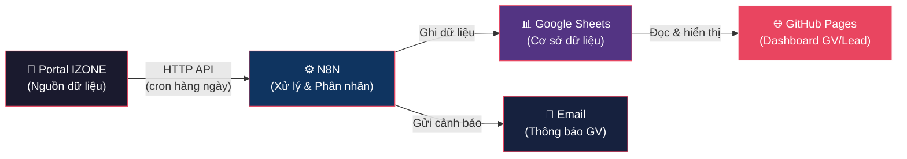
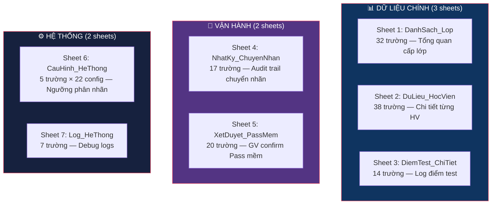
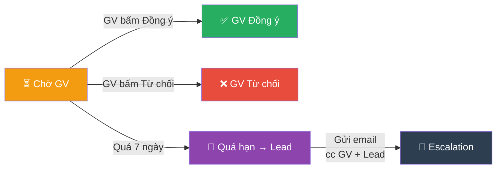
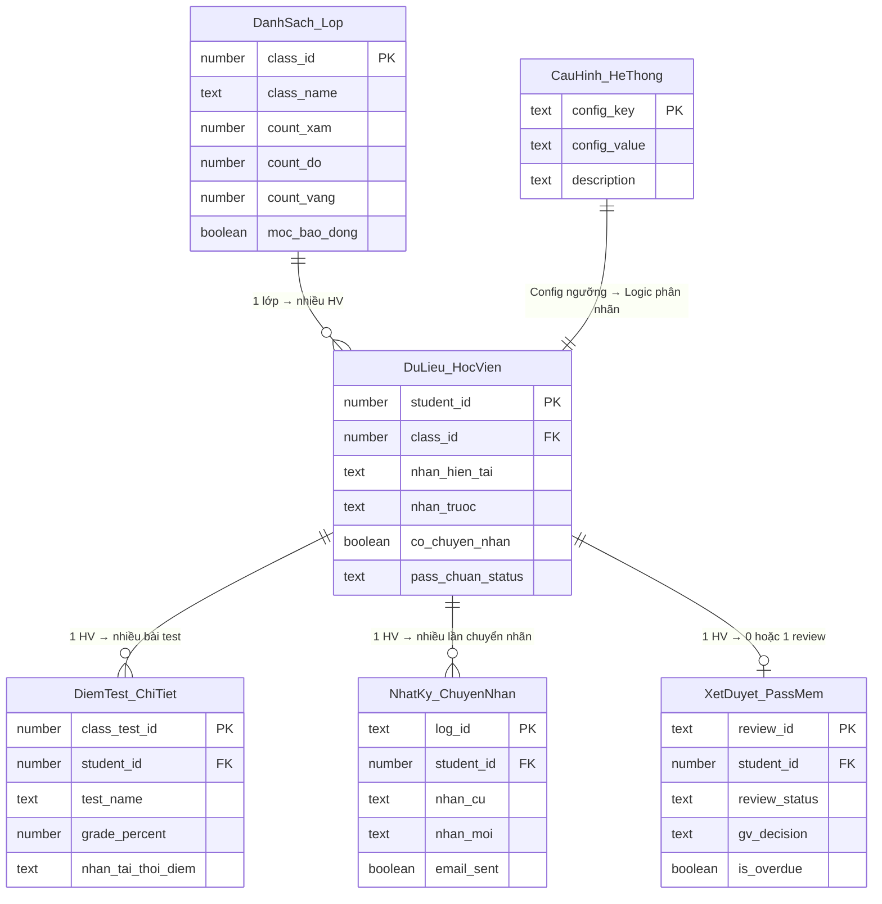

# 📋 BÁO CÁO THIẾT KẾ TRƯỜNG DỮ LIỆU GOOGLE SHEETS
## Hệ thống Phân nhãn Học viên — Khối 3-4

| | |
|---|---|
| **Dự án** | Phân loại & Giám sát Học viên IZONE |
| **Phạm vi** | Khối 3-4 (course_id = 2) — Thí điểm |
| **Ngày báo cáo** | 24/07/2026 |
| **Người soạn** | Toản (hỗ trợ AI) |
| **Trình bày cho** | Lead Khối / Ban Quản lý |

---

## 1. Bối cảnh & Mục tiêu

### 1.1. Vấn đề hiện tại

Hiện tại, việc theo dõi và phân loại học viên đang được thực hiện **hoàn toàn thủ công**: GV vào portal lấy điểm, copy vào file Excel riêng, tự đối chiếu ngưỡng, tự nhớ lịch gửi báo cáo. Điều này dẫn đến:

- ❌ Mỗi GV một file, không ai tổng hợp được
- ❌ Không có cảnh báo tự động khi HV tụt điểm/chuyên cần
- ❌ Lead không có bức tranh toàn cảnh để ra quyết định
- ❌ Quy trình xét Pass/Fail cuối khóa tốn nhiều thời gian

### 1.2. Giải pháp đề xuất

Xây dựng hệ thống **tự động hóa 3 lớp**:



### 1.3. Quy tắc phân nhãn (đã thống nhất từ BenchMark Khối 3-4)

| Nhãn | Ngưỡng điểm | Chân dung | Tỷ lệ lịch sử (n=1,474) |
|:---:|---|---|---|
| ⬜ **Xám** | TB Test < **45** | Rủi ro cao nhất. Dù ĐH&BTVN 83%, vẫn gần như không pass | 133 HV (9.0%) |
| 🔴 **Đỏ** | **45** ≤ TB Test < **60** | Tiềm năng. Nếu ĐH&BTVN ≥ 90% → tỷ lệ pass 61.7% | 271 HV (18.4%) |
| 🟡 **Vàng** | TB Test ≥ **60** | An toàn. Pass chuẩn lịch sử 76.3% | 1,070 HV (72.6%) |

---

## 2. Thiết Kế Google Sheets — Tổng Quan

### 2.1. Cấu trúc Workbook

Workbook gồm **7 sheets**, chia thành 3 nhóm chức năng:



| # | Sheet | Số trường | Mục đích | Ai dùng |
|---|---|:---:|---|---|
| 1 | `DanhSach_Lop` | 32 | Nhìn 1 sheet → nắm toàn bộ khối | **Lead Khối** |
| 2 | `DuLieu_HocVien` | 38 | Dữ liệu gốc cho Dashboard + phân nhãn | **GV + Lead** |
| 3 | `DiemTest_ChiTiet` | 14 | Theo dõi trend tiến bộ/tụt giảm qua từng test | **GV + Hệ thống** |
| 4 | `NhatKy_ChuyenNhan` | 17 | Ghi lại mọi lần chuyển nhãn → trigger email | **Hệ thống + Lead** |
| 5 | `XetDuyet_PassMem` | 20 | GV confirm Pass mềm qua Dashboard | **GV** |
| 6 | `CauHinh_HeThong` | 5 × 22 rows | Lead thay đổi ngưỡng mà không cần sửa code | **Admin/Lead** |
| 7 | `Log_HeThong` | 7 | Debug khi hệ thống gặp lỗi | **Dev** |

---

## 3. Chi Tiết Thiết Kế Từng Sheet

### 3.1. Sheet 1: `DanhSach_Lop` — Bức tranh toàn khối

> **Mục đích**: Lead mở 1 sheet, nhìn được ngay lớp nào cần chú ý, lớp nào an toàn.

#### Nhóm trường: Thông tin lớp

| # | Trường | Kiểu | Mô tả | Ví dụ mock |
|---|---|---|---|---|
| 1 | `class_id` | Number | ID lớp từ Portal | `1159` |
| 2 | `class_name` | Text | Mã lớp | `IC2174` |
| 3 | `course_id` | Number | ID khóa (2 = Khối 34) | `2` |
| 4 | `teacher_id` | Number | ID giáo viên | `305` |
| 5 | `teacher_name` | Text | Tên GV | `Trần Minh Phương` |
| 6 | `teacher_email` | Text | Email GV (cho alert) | `phuong.tm@izone.edu.vn` |
| 7 | `status` | Text | Trạng thái lớp | `on_going` |
| 8 | `lich_hoc` | Text | Lịch học | `3,6` |
| 9 | `dia_diem` | Text | Cơ sở / Online | `Online` |

#### Nhóm trường: Tiến độ

| # | Trường | Kiểu | Mô tả | Ví dụ mock |
|---|---|---|---|---|
| 10 | `ngay_khai_giang` | Date | Ngày khai giảng | `2026-05-19` |
| 11 | `ngay_ket_thuc` | Date | Ngày kết thúc | `2026-08-25` |
| 12 | `total_sessions` | Number | Tổng buổi | `28` |
| 13 | `completed_sessions` | Number | Buổi đã học | `17` |
| 14 | `session_progress` | Text | Tiến độ | `17/28` |

#### Nhóm trường: Sĩ số & Chuyên cần

| # | Trường | Kiểu | Mô tả | Ví dụ mock |
|---|---|---|---|---|
| 15 | `active_students` | Number | HV đang học | `18` |
| 16 | `on_hold_students` | Number | HV bảo lưu | `0` |
| 17 | `dropped_students` | Number | HV bỏ học | `1` |
| 18 | `attendance_class_avg` | % | TB Đi học toàn lớp | `95.0` |
| 19 | `homework_class_avg` | % | TB BTVN toàn lớp | `93.1` |
| 20 | `tinh_trang` | Text | Tình trạng lớp | `Bình thường` |

#### Nhóm trường: ⭐ Phân nhãn — Điểm nhấn quan trọng nhất

| # | Trường | Kiểu | Mô tả | Ví dụ mock |
|---|---|---|---|---|
| 21 | **`count_xam`** | Number | Số HV nhóm Xám | `2` |
| 22 | **`count_do`** | Number | Số HV nhóm Đỏ | `4` |
| 23 | **`count_vang`** | Number | Số HV nhóm Vàng | `11` |
| 24 | **`count_chua_co_dl`** | Number | HV chưa có điểm test | `1` |
| 25 | **`pct_xam`** | % | Tỷ lệ Xám | `11.1` |
| 26 | **`pct_do`** | % | Tỷ lệ Đỏ | `22.2` |
| 27 | **`pct_vang`** | % | Tỷ lệ Vàng | `61.1` |
| 28 | **`moc_bao_dong`** | Boolean | ⚠️ TRUE nếu Xám+Đỏ ≥ 40% | `FALSE` |

> [!IMPORTANT]
> Trường `moc_bao_dong` là **chỉ báo cấp cao nhất** cho Lead. Khi giá trị = TRUE, có nghĩa gần một nửa lớp đang ở vùng rủi ro. Ngưỡng 40% có thể điều chỉnh trong sheet `CauHinh_HeThong`.

#### Nhóm trường: Pass & Metadata

| # | Trường | Kiểu | Mô tả | Ví dụ mock |
|---|---|---|---|---|
| 29 | `pass_chuan_rate` | % | Tỷ lệ HV có khả năng pass chuẩn | `55.6` |
| 30 | `pass_mem_rate` | % | Tỷ lệ HV đạt pass mềm | `66.7` |
| 31 | `link_portal` | URL | Link Portal lớp | `https://portal.izone.edu.vn/...` |
| 32 | `scraped_at` | Date | Lần cập nhật gần nhất | `2026-07-24` |

#### 📊 Mock data minh họa (3 lớp)

| Lớp | HV | Buổi | ĐH | BTVN | ⬜Xám | 🔴Đỏ | 🟡Vàng | ⚠️Báo động | Pass chuẩn |
|---|:---:|:---:|:---:|:---:|:---:|:---:|:---:|:---:|:---:|
| **IC2174** | 18 | 17/28 | 95.0% | 93.1% | 2 (11%) | 4 (22%) | 11 (61%) | ❌ | 55.6% |
| **IC2030** | 17 | 28/28 | 92.6% | 93.5% | 2 (12%) | 5 (29%) | 10 (59%) | ⚠️ **CÓ** | 47.1% |
| **IC1924** | 18 | 28/28 | 93.4% | 92.9% | 2 (11%) | 7 (39%) | 9 (50%) | ⚠️ **CÓ** | 50.0% |

---

### 3.2. Sheet 2: `DuLieu_HocVien` — Sheet quan trọng nhất

> **Mục đích**: Mỗi hàng = 1 học viên. Đây là nguồn dữ liệu chính cho Dashboard GV và toàn bộ logic phân nhãn.

#### Nhóm A: Thông tin cơ bản (6 trường)

| # | Trường | Kiểu | Mô tả |
|---|---|---|---|
| 1 | `student_id` | Number | ID HV trên Portal |
| 2 | `full_name` | Text | Họ tên HV |
| 3 | `class_id` | Number | ID lớp |
| 4 | `class_name` | Text | Mã lớp |
| 5 | `registration_status` | Text | `on_going` / `on_hold` / `dropped` / `transferred` |
| 6 | `admitted_at` | Date | Ngày nhập học |

#### Nhóm B: Chuyên cần (6 trường)

| # | Trường | Kiểu | Mô tả |
|---|---|---|---|
| 7 | `attendance_pct` | % | Tỷ lệ đi học |
| 8 | `attendance_present` | Number | Số buổi có mặt |
| 9 | `attendance_total` | Number | Tổng buổi tính |
| 10 | `homework_pct` | % | Tỷ lệ làm BTVN |
| 11 | `homework_done` | Number | Số bài đã làm |
| 12 | `homework_total` | Number | Tổng bài tính |

#### Nhóm C: Điểm Test (8 trường)

| # | Trường | Kiểu | Mô tả |
|---|---|---|---|
| 13 | `test_1` | Number | Điểm Test 1 (**Benchmark**) |
| 14 | `test_2` | Number | Điểm Test 2 |
| 15 | `test_3` | Number | Điểm Test 3 |
| 16 | `test_4` | Number | Điểm Test 4 |
| 17 | `test_5` | Number | Điểm Test 5 |
| 18 | `test_6` | Number | Điểm Test 6 (Test cuối) |
| 19 | `tests_taken` | Number | Số test đã làm (mẫu số tính TB) |
| 20 | `test_average` | Number | **TB điểm test** — dùng để phân nhãn |

> [!NOTE]
> `test_average` = Tổng điểm các test đã làm ÷ Số test đã làm (không chia cho 6). HV vắng test → test đó không tính vào mẫu số.

#### Nhóm D: ⭐ Phân nhãn (6 trường)

| # | Trường | Kiểu | Mô tả |
|---|---|---|---|
| 21 | **`nhan_hien_tai`** | Text | Nhãn hiện tại: `Xám` / `Đỏ` / `Vàng` / `Chưa có DL` |
| 22 | **`nhan_truoc`** | Text | Nhãn lần đánh giá trước |
| 23 | **`nhan_benchmark`** | Text | Nhãn gốc từ Test 1 (không đổi) |
| 24 | **`co_chuyen_nhan`** | Boolean | Có chuyển nhãn so với lần trước? |
| 25 | **`huong_chuyen_nhan`** | Text | `Đỏ → Vàng` / `Vàng → Đỏ` / `Không đổi` |
| 26 | **`checkpoint_gan_nhan`** | Text | Dựa trên bài test nào: `Test 2`, `Test 3`... |

> [!IMPORTANT]
> **Logic phân nhãn:**
> ```
> TB Test < 45       → Xám (rủi ro cao)
> 45 ≤ TB Test < 60  → Đỏ (tiềm năng)
> TB Test ≥ 60       → Vàng (an toàn)
> Chưa có điểm       → Chưa có DL (GV gán tạm)
> ```
> Nhãn được **cập nhật lại** sau mỗi bài Test mới. Trường `nhan_benchmark` giữ nguyên nhãn từ Test 1 để đối chiếu cuối chu kỳ.

#### Nhóm E: Đánh giá Pass (5 trường)

| # | Trường | Kiểu | Mô tả |
|---|---|---|---|
| 27 | `pass_chuan_status` | Text | `Có khả năng pass` / `Chưa đạt` / `Chưa đủ DL` |
| 28 | `pass_chuan_reasons` | Text | Lý do chưa đạt (nếu có) |
| 29 | `pass_mem_status` | Text | `Đạt pass mềm` / `Không đạt` |
| 30 | `pass_mem_group` | Text | `Nhóm 1` / `Nhóm 2` / `Nhóm 3` |
| 31 | `pass_mem_label` | Text | Mô tả điều kiện nhóm |

**Điều kiện Pass chuẩn vs Pass mềm:**

| | Pass Chuẩn | Pass Mềm Nhóm 1 | Pass Mềm Nhóm 2 | Pass Mềm Nhóm 3 |
|---|:---:|:---:|:---:|:---:|
| **TB Test** | ≥ 60 | 50 – <55 | 55 – <60 | ≥ 60 |
| **Đi học** | > 90% | = 100% | ≥ 90% | Không bắt buộc |
| **BTVN** | > 90% | = 100% | ≥ 90% | Không bắt buộc |
| **GV confirm** | Không cần | ✅ Cần | ✅ Cần | Không cần |

#### Nhóm F: Cờ cảnh báo (4 trường)

| # | Trường | Kiểu | Mô tả |
|---|---|---|---|
| 32 | **`flag_dh_tut`** | Boolean | ĐH < 80% → cảnh báo GV |
| 33 | **`flag_btvn_tut`** | Boolean | BTVN < 80% → cảnh báo GV |
| 34 | **`flag_cheating`** | Boolean | Bị phát hiện gian lận |
| 35 | **`flag_can_review`** | Boolean | Cần GV review Pass mềm |

#### Nhóm G: GV ghi chú (3 trường)

| # | Trường | Kiểu | Mô tả |
|---|---|---|---|
| 36 | `gv_note` | Text | Ghi chú của GV |
| 37 | `gv_nhan_tam` | Text | Nhãn tạm do GV gán (khi HV chưa có test) |
| 38 | `scraped_at` | Date | Thời điểm cập nhật |

#### 📊 Mock data minh họa — Lớp IC2174

| Họ tên | ĐH | BTVN | T1 | T2 | T3 | TB | **Nhãn** | Chuyển | Pass chuẩn |
|---|:---:|:---:|:---:|:---:|:---:|:---:|:---:|---|---|
| Lý Thanh Tùng | 100% | 100% | 90.0 | 88.0 | 92.5 | 90.2 | 🟡 | Không đổi | ✅ Có khả năng |
| Lê Khả Hân | 94% | 100% | 93.5 | 85.0 | 91.5 | 90.0 | 🟡 | Không đổi | ✅ Có khả năng |
| Ngô Minh Châu | 100% | 94% | 82.0 | 78.5 | 85.0 | 81.8 | 🟡 | Không đổi | ✅ Có khả năng |
| Nguyễn Trường Huy | 100% | 100% | 54.0 | 70.5 | 76.0 | 66.8 | 🟡 | **Đỏ→Vàng** ⬆️ | ✅ Có khả năng |
| Đặng Thùy Linh | 94% | 100% | 55.5 | 58.0 | 62.0 | 58.5 | 🔴 | Đỏ→Đỏ | ❌ TB test <60 |
| Phạm Đức Minh | 94% | 94% | 45.0 | 52.0 | 48.5 | 48.5 | 🔴 | Không đổi | ❌ TB test <60 |
| Nguyễn Thu Huyền | 100% | 53% | 50.0 | 47.5 | 46.0 | 47.8 | 🔴 | Không đổi | ❌ BTVN ≤90% |
| Trần Thị Mai | 82% | 88% | 38.0 | 42.0 | 40.5 | 40.2 | ⬜ | Không đổi | ❌ Cả 3 chưa đạt |
| Bùi Quốc Đạt | 76% | 71% | 35.0 | 40.0 | 38.0 | 37.7 | ⬜ | Không đổi | ❌ Cả 3 chưa đạt |
| Hoàng Yến Nhi | 94% | 88% | — | — | — | — | ❓ | GV gán tạm | Chưa đủ DL |

---

### 3.3. Sheet 3: `DiemTest_ChiTiet` — Log điểm chi tiết

> **Mục đích**: Lưu chi tiết điểm từng bài test + nhãn được gán tại thời điểm đó → phát hiện trend.

| # | Trường | Kiểu | Mô tả |
|---|---|---|---|
| 1 | `student_id` | Number | ID HV |
| 2 | `full_name` | Text | Họ tên |
| 3 | `class_id` | Number | ID lớp |
| 4 | `class_name` | Text | Mã lớp |
| 5 | `class_test_id` | Number | ID bài test |
| 6 | `test_name` | Text | `Test 1`, `Test 2`, ... |
| 7 | `raw_grade` | Number | Điểm gốc |
| 8 | `max_grade` | Number | Điểm tối đa (thường = 100) |
| 9 | `grade_percent` | % | Điểm quy đổi |
| 10 | `grade_status` | Text | `confirmed` / `pending` |
| 11 | `is_cheating` | Boolean | Đánh dấu gian lận |
| 12 | `grade_note` | Text | Ghi chú |
| 13 | **`nhan_tai_thoi_diem`** | Text | Nhãn tại checkpoint này |
| 14 | `scraped_at` | Date | Thời điểm ghi nhận |

> [!TIP]
> Trường `nhan_tai_thoi_diem` cho phép xem **hành trình nhãn** của HV: ví dụ Đỏ → Đỏ → Vàng → Vàng (tức là HV tiến bộ từ Test 3 trở đi). Rất hữu ích khi GV cần đánh giá "sự tiến bộ" cho Pass mềm.

**Mock data**: Tổng **267 bản ghi** điểm từ 57 HV × các test đã làm.

---

### 3.4. Sheet 4: `NhatKy_ChuyenNhan` — Audit Trail

> **Mục đích**: Ghi lại **mọi lần** HV chuyển nhãn → (1) trigger email cho GV, (2) Lead đối chiếu cuối chu kỳ.

| # | Trường | Kiểu | Mô tả |
|---|---|---|---|
| 1 | `log_id` | UUID | ID bản ghi |
| 2-5 | `student_id`, `full_name`, `class_id`, `class_name` | — | Thông tin HV/lớp |
| 6 | `teacher_email` | Text | Email GV (gửi alert) |
| 7 | **`nhan_cu`** | Text | Nhãn trước chuyển |
| 8 | **`nhan_moi`** | Text | Nhãn sau chuyển |
| 9 | **`huong`** | Text | `Lên` / `Xuống` / `Đặc biệt` |
| 10 | `ly_do` | Text | Lý do chi tiết |
| 11 | `checkpoint` | Text | Dựa trên test nào |
| 12-14 | `test_average_moi`, `dh_pct`, `btvn_pct` | Number | Các chỉ số tại thời điểm |
| 15 | `email_sent` | Boolean | Đã gửi email? |
| 16 | `email_sent_at` | DateTime | Thời điểm gửi |
| 17 | `created_at` | DateTime | Thời điểm tạo log |

#### 📊 Mock data minh họa — 6 sự kiện chuyển nhãn

| HV | Lớp | Chuyển | Lý do |
|---|---|:---:|---|
| Nguyễn Trường Huy | IC2174 | 🔴→🟡 ⬆️ | TB test tăng 66.8 sau Test 3 |
| Đặng Thùy Linh | IC2174 | 🔴→🟡 ⬆️ | Test 3 = 62.0, xu hướng tăng |
| Trịnh Văn Hào | IC2174 | 🟡→🔴 ⬇️ | Test 3 chỉ 58.0, TB tụt |
| Phạm Văn Kiên | IC2030 | 🔴→🟡 ⬆️ | TB 6 test đạt 61.3 |
| Lê Thị Thanh Trúc | IC2030 | 🔴→🟡 ⬆️ | Tiến bộ đều 48→62 |
| Hoàng Văn Phúc | IC1924 | ⬜→🔴 ⬆️ | TB tăng dần, Test 6 = 48 |

---

### 3.5. Sheet 5: `XetDuyet_PassMem` — GV Confirm

> **Mục đích**: Khi HV thuộc diện "Pass mềm" (Nhóm 1 hoặc 2) → tạo bản ghi ở đây → GV bấm nút xác nhận trên Dashboard.

| # | Trường | Kiểu | Mô tả |
|---|---|---|---|
| 1 | `review_id` | UUID | ID yêu cầu |
| 2-7 | Thông tin HV + GV | — | student_id, class_id, teacher_email, ... |
| 8 | `pass_mem_group` | Text | Nhóm 1 / Nhóm 2 |
| 9-11 | `test_average`, `attendance_pct`, `homework_pct` | Number | Các chỉ số |
| 12 | **`review_status`** | Text | 4 trạng thái (xem bên dưới) |
| 13 | `gv_decision` | Text | `Pass` / `Fail` |
| 14 | `gv_comment` | Text | Nhận xét GV |
| 15 | `gv_confirmed_at` | DateTime | Thời điểm confirm |
| 16 | `deadline` | DateTime | Hạn chót (7 ngày) |
| 17 | **`is_overdue`** | Boolean | Quá hạn? |
| 18 | **`escalated_to_lead`** | Boolean | Đã chuyển Lead? |
| 19 | `lead_email_sent` | Boolean | Đã gửi email Lead? |
| 20 | `created_at` | DateTime | Thời điểm tạo |

**4 trạng thái xét duyệt:**



#### 📊 Mock data — 4 case mẫu (đủ 4 trạng thái)

| HV | Nhóm | TB Test | ĐH | BTVN | Trạng thái |
|---|:---:|:---:|:---:|:---:|---|
| Phạm Đức Minh | Nhóm 1 | 48.5 | 94% | 94% | ⏳ **Chờ GV** |
| Lê Thị Thanh Trúc | Nhóm 2 | 55.8 | 100% | 100% | ✅ **GV Đồng ý** — "HV tiến bộ rõ rệt" |
| Đặng Văn Hùng | Nhóm 2 | 55.0 | 92% | 95% | ❌ **GV Từ chối** — "Điểm lên xuống thất thường" |
| Đặng Minh Trí | Nhóm 2 | 57.2 | 95% | 92% | 🔴 **Quá hạn → Lead** |

---

### 3.6. Sheet 6: `CauHinh_HeThong` — Config linh hoạt

> **Mục đích**: Cho phép Lead/Admin thay đổi ngưỡng phân nhãn, ngưỡng Pass, ngưỡng cảnh báo **mà không cần sửa code N8N**. N8N đọc config từ sheet này mỗi lần chạy.

| # | Trường | Kiểu | Mô tả |
|---|---|---|---|
| 1 | `config_key` | Text | Tên cấu hình (khóa) |
| 2 | `config_value` | Text/Number | Giá trị |
| 3 | `description` | Text | Mô tả bằng tiếng Việt |
| 4 | `updated_at` | Date | Cập nhật lần cuối |
| 5 | `updated_by` | Text | Người cập nhật |

**22 config đã thiết lập:**

| Nhóm | Config | Giá trị | Ý nghĩa |
|---|---|:---:|---|
| **Ngưỡng nhãn** | `nguong_xam_max` | 45 | Xám nếu TB test < 45 |
| | `nguong_do_min` / `nguong_do_max` | 45 / 60 | Đỏ nếu 45 ≤ TB test < 60 |
| | `nguong_vang_min` | 60 | Vàng nếu TB test ≥ 60 |
| **Pass chuẩn** | `pass_dh_min` | 90 | ĐH phải > 90% |
| | `pass_btvn_min` | 90 | BTVN phải > 90% |
| | `pass_test_avg_min` | 60 | TB test phải ≥ 60 |
| **Pass mềm** | `soft_g1_*` | 50-55 / 100% | Nhóm 1: Test 50-<55, ĐH&BTVN 100% |
| | `soft_g2_*` | 55-60 / 90% | Nhóm 2: Test 55-<60, ĐH&BTVN ≥90% |
| **Cảnh báo** | `moc_bao_dong_pct` | 40 | Báo động nếu Xám+Đỏ ≥ 40% |
| | `alert_dh_tut_pct` | 80 | Cảnh báo nếu ĐH tuần < 80% |
| | `review_deadline_days` | 7 | GV có 7 ngày để confirm |
| **Hệ thống** | `cheating_test_score` | 0 | Test cheating tính = 0 điểm |
| | `cron_schedule` | `0 10 * * *` | Chạy hàng ngày 10h sáng |

> [!TIP]
> Khi Lead muốn thay đổi ngưỡng (ví dụ: sau 1 chu kỳ thấy nhóm Xám quá ít, muốn nâng từ <45 lên <50), chỉ cần sửa giá trị trong sheet này. Hệ thống sẽ tự đọc config mới ở lần chạy tiếp theo.

---

### 3.7. Sheet 7: `Log_HeThong` — System Logs

> **Mục đích**: Debug + audit cho dev khi N8N chạy. Không cần quan tâm ở góc độ nghiệp vụ.

| # | Trường | Kiểu | Mô tả |
|---|---|---|---|
| 1 | `timestamp` | DateTime | Thời điểm |
| 2 | `workflow_name` | Text | Tên workflow N8N |
| 3 | `action` | Text | `scrape_data` / `update_labels` / `send_email` / ... |
| 4 | `class_id` | Number | Lớp liên quan |
| 5 | `status` | Text | `success` / `error` / `warning` |
| 6 | `message` | Text | Chi tiết |
| 7 | `records_affected` | Number | Số bản ghi xử lý |

---

## 4. Xử Lý Các Trường Hợp Đặc Biệt (Edge Cases)

| Tình huống | Quy tắc | Trường liên quan |
|---|---|---|
| HV **chưa có điểm test** | Nhãn = `Chưa có DL`. GV gán tạm qua `gv_nhan_tam` | `nhan_hien_tai`, `gv_nhan_tam` |
| HV **bị cheating** | Điểm test đó = 0. `flag_cheating = TRUE` | `is_cheating`, `flag_cheating` |
| HV **bảo lưu** giữa khóa | Giữ dữ liệu cũ. `status = on_hold`. Ẩn khỏi dashboard | `registration_status` |
| HV **chuyển lớp** | Mang theo điểm cũ. TB tính trên tất cả test | `registration_status = transferred` |
| HV **vắng test** | Không tính test đó vào mẫu số. TB = tổng/số test đã làm | `tests_taken`, `test_average` |
| GV **không confirm** trong 7 ngày | Gửi nhắc → cc Lead khối | `is_overdue`, `escalated_to_lead` |
| Portal **thiếu dữ liệu** | Ghi những gì có + log cảnh báo | `Log_HeThong` |

---

## 5. Mối Quan Hệ Giữa Các Sheet



---

## 6. Tóm Tắt Số Liệu Mock Data

| Chỉ số | Giá trị |
|---|:---:|
| Tổng số lớp | 3 (IC2174, IC2030, IC1924) |
| Tổng số HV | 57 |
| HV đang học (active) | 53 |
| HV bảo lưu | 1 |
| HV bỏ học/chuyển | 3 |
| Tổng bản ghi điểm | 267 |
| Sự kiện chuyển nhãn | 6 |
| Case xét duyệt Pass mềm | 4 |
| Config hệ thống | 22 |

### Phân bố nhãn (53 HV active)

```
🟡 Vàng:  30 HV  (56.6%)  ████████████████████░░░░░░░░░░░░░░░
🔴 Đỏ:    16 HV  (30.2%)  ██████████████░░░░░░░░░░░░░░░░░░░░░
⬜ Xám:    6 HV  (11.3%)  █████░░░░░░░░░░░░░░░░░░░░░░░░░░░░░░
❓ Chưa DL: 1 HV  ( 1.9%)  █░░░░░░░░░░░░░░░░░░░░░░░░░░░░░░░░░░
```

---

## 7. Các Bước Tiếp Theo

| # | Đầu việc | Ưu tiên | PIC |
|---|---|:---:|---|
| 1 | ✅ Thiết kế fields Google Sheets (hoàn thành) | — | Toản |
| 2 | ✅ Tạo mock data minh họa (hoàn thành) | — | Toản |
| 3 | 🔲 Import CSV vào Google Sheets Workbook mới | 🔴 | Toản |
| 4 | 🔲 Format conditional (màu nhãn, highlight cảnh báo) | 🔴 | Toản |
| 5 | 🔲 Trình bày Lead để phê duyệt thiết kế | 🔴 | Toản |
| 6 | 🔲 Mở rộng N8N workflow để ghi dữ liệu cấp HV | 🟡 | Đức Anh |
| 7 | 🔲 Xây dựng Dashboard GitHub Pages | 🟡 | Dev team |
| 8 | 🔲 Setup email alert system | 🟢 | Đức Anh |

---

> [!NOTE]
> **Tài liệu tham chiếu:**
> - [BenchMark3_4.md](file:///root/proctoring-tool/docs/BenchMark3_4.md) — Cơ sở dữ liệu & ngưỡng phân nhãn
> - [Meeting Brief.md](file:///root/proctoring-tool/docs/Meeting%20Brief.md) — Biên bản họp thống nhất luồng
> - [N8N Workflow](file:///root/proctoring-tool/n8n/Gan_nhan_hoc_vien/C%E1%BA%ADp%20nh%E1%BA%ADt%20d%E1%BB%AF%20li%E1%BB%87u%20c%C3%A1c%20l%E1%BB%9Bp%2034.json) — Workflow hiện tại (đang ghi cấp lớp)
> - [Script tạo mock data](file:///root/proctoring-tool/google_sheets/generate_mock_data.py) — Source code tạo CSV
> - [Thư mục CSV output](file:///root/proctoring-tool/google_sheets/csv_output/) — 7 file CSV sẵn sàng import
